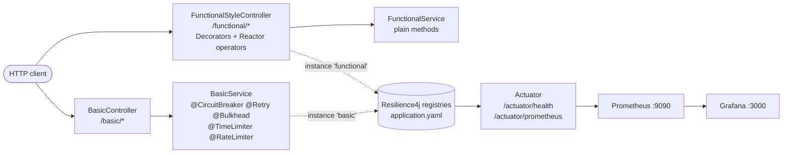

# Resilience4j Spring Boot Demo

[](https://github.com/xinqilin/spring-boot-CircuitBreaker/actions/workflows/build.yml)

English | [繁體中文](README.zh-TW.md)

All five Resilience4j fault-tolerance patterns — Circuit Breaker, Retry, Bulkhead, Time Limiter, Rate Limiter — implemented **twice** on Spring Boot 4.1, once with annotations and once with the functional API, and verified by **one test suite that runs the same scenarios against both**.

| Style | Endpoints | How |
|---|---|---|
| **Annotation-based** | `/basic/*` | `@CircuitBreaker`, `@Retry`, `@Bulkhead`, `@TimeLimiter`, `@RateLimiter` |
| **Functional API** | `/functional/*` | `Decorators` builder + Reactor operators (`CircuitBreakerOperator`, etc.) |

## What this repo shows

Behaviours that are easy to get wrong, each pinned down by a test in [`ResilienceEndpointsTest`](src/test/kotlin/com/bill/circuitBreaker/controller/ResilienceEndpointsTest.kt):

- **Annotation order in source code does not matter.** Spring aspects always apply `Retry(CircuitBreaker(RateLimiter(TimeLimiter(Bulkhead(call)))))`. Because Retry wraps the circuit breaker, one failing request records 3 failures — **two requests are enough to open the `basic` circuit**.
- **4xx and business exceptions are counted as success, not ignored.** They still fill the sliding window; only `ignoreExceptions` skips counting. Annotations (`recordExceptions`) and the functional style (`RecordFailurePredicate`) reach the same result by different mechanisms.
- **Your own rate limiting must not trip the breaker.** A deny-list failure predicate ("record everything except X") also records Resilience4j's `RequestNotPermitted`; a burst then opens the circuit. The functional style uses an allow-list for this reason.
- **One circuit breaker instance per downstream.** Every `/basic/*` endpoint shares the `basic` instance, so once `/basic/failure` opens it, `/basic/rateLimited` is rejected too.
- **Fallbacks are type-matched.** Overloaded fallback methods pick the most specific exception type (`TimeoutException` vs `CallNotPermittedException` vs `Exception`).
- **Spring Framework 7 now has `@Retryable` and `@ConcurrencyLimit` built in.** [`SpringCoreVsResilience4jTest`](src/test/kotlin/com/bill/circuitBreaker/example/SpringCoreVsResilience4jTest.kt) compares them with Resilience4j under a burst of virtual threads — BLOCK throttles, REJECT and `@Bulkhead` fail fast. See [when to use which](docs/quick-apply.md#12-spring-framework-7-core-resilience-vs-resilience4j).

Also included: recipes for Kotlin `WebClient`, Java `RestClient` and Kotlin coroutines (`example/*`), and state-transition tests in both Kotlin and Java.

## Architecture



**Annotation style** keeps business logic clean — resilience is declared as metadata and applied by the AOP proxy. **Functional style** makes the chain explicit and composable: `FunctionalStyleController` builds `Decorators.ofSupplier(…).withCircuitBreaker(…).withBulkhead(…).withRetry(…)` for synchronous calls and `.transform(…Operator.of(…))` chains for `Mono` / `Flux`.

## Quick Start

Requires Java 21.

```bash
./gradlew build      # compile + run all tests
./gradlew bootRun    # start on http://localhost:8080
docker compose up -d # optional: Prometheus :9090 + Grafana :3000
```

### 60-second tour

With the app running:

```bash
# Time Limiter: the call takes 10s, times out at 2s and falls back
curl localhost:8080/basic/monoTimeout
# Recovered: java.util.concurrent.TimeoutException: ...

# Rate Limiter: 10 calls/s, the rest go to the fallback
for i in $(seq 1 12); do curl -s localhost:8080/basic/rateLimited; echo; done | sort | uniq -c

# Retry amplification: two failing requests open the circuit
for i in 1 2; do curl -s -o /dev/null localhost:8080/basic/failure; done
curl -s localhost:8080/actuator/health | jq '.components.circuitBreakers.details.basic.details.state'
# "OPEN"

# Same scenarios with the functional style
curl localhost:8080/functional/monoTimeout
```

## Documentation

| Document | Contents |
|---|---|
| [Patterns in depth](docs/patterns.md) | Each pattern with config, code from both styles, fallback strategies, failure classification |
| [Quick Apply Guide](docs/quick-apply.md) | Copy-paste starters for your own project, ordering and fallback rules, WebClient / RestClient / coroutine integration, state-transition testing, production tuning and PromQL alerts, Spring Framework 7 core resilience vs Resilience4j |
| [Reference](docs/reference.md) | All endpoints, full configuration, metrics and actuator health |

## Tech Stack

Java 21 · Kotlin 2.3.21 · Spring Boot 4.1.1 · Resilience4j 2.4.0 · Project Reactor · Micrometer + Prometheus · Gradle 9.8.1

## License

[Apache License 2.0](LICENSE).

This project started from [resilience4j/resilience4j-spring-boot2-demo](https://github.com/resilience4j/resilience4j-spring-boot2-demo), Copyright 2019 Robert Winkler, licensed under the Apache License 2.0. Modifications Copyright 2024-2026 Bill Lin.
