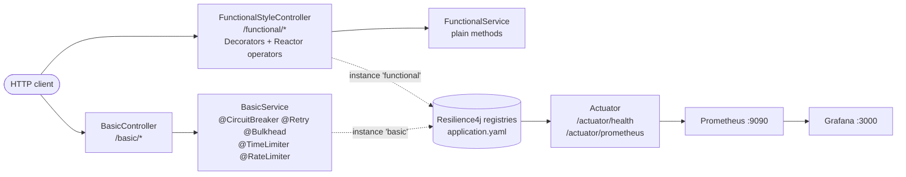

# Resilience4j Spring Boot 示範專案

[](https://github.com/xinqilin/spring-boot-CircuitBreaker/actions/workflows/build.yml)

[English](README.md) | 繁體中文

在 Spring Boot 4.1 上把 Resilience4j 五大容錯模式（Circuit Breaker、Retry、Bulkhead、Time Limiter、Rate Limiter）**實作兩次**：一次用注解、一次用函式式 API，並以**同一組測試對兩邊跑相同情境**來驗證行為一致。

| 風格 | 端點 | 實作方式 |
|---|---|---|
| **Annotation 注解式** | `/basic/*` | `@CircuitBreaker`、`@Retry`、`@Bulkhead`、`@TimeLimiter`、`@RateLimiter` |
| **Functional API 函式式** | `/functional/*` | `Decorators` 建構器 + Reactor 運算子（`CircuitBreakerOperator` 等） |

## 這個 repo 展示什麼

以下容易搞錯的行為，每一項都由 [`ResilienceEndpointsTest`](src/test/kotlin/com/bill/circuitBreaker/controller/ResilienceEndpointsTest.kt) 中的測試鎖定：

- **注解在原始碼中的書寫順序不影響執行順序。** Spring aspect 永遠以 `Retry(CircuitBreaker(RateLimiter(TimeLimiter(Bulkhead(call)))))` 套用。由於 Retry 包住斷路器，一次失敗請求會記錄 3 次失敗 —— **兩次請求就足以讓 `basic` 斷路器開路**。
- **4xx 與業務例外會計為成功，而不是被忽略。** 它們仍會填入滑動視窗；只有 `ignoreExceptions` 才會完全不計。注解式（`recordExceptions`）與函式式（`RecordFailurePredicate`）以不同機制得到相同結果。
- **自己的限流不該讓斷路器開路。** 黑名單式的失敗判斷（「除了 X 以外都記錄」）也會把 Resilience4j 的 `RequestNotPermitted` 記為失敗，一陣突發流量就會讓斷路器開路。因此函式式風格改用白名單。
- **每個下游服務各用一個斷路器實例。** 所有 `/basic/*` 端點共用 `basic` 實例，所以 `/basic/failure` 讓它開路後，`/basic/rateLimited` 也會一起被拒絕。
- **Fallback 依例外型別匹配。** 多載的 fallback 方法會選擇最精確的例外型別（`TimeoutException` / `CallNotPermittedException` / `Exception`）。
- **Spring Framework 7 已內建 `@Retryable` 與 `@ConcurrencyLimit`。** [`SpringCoreVsResilience4jTest`](src/test/kotlin/com/bill/circuitBreaker/example/SpringCoreVsResilience4jTest.kt) 以大量 virtual threads 同時呼叫，與 Resilience4j 對照 —— BLOCK 會排隊等待，REJECT 與 `@Bulkhead` 則立即拒絕。參見[該選哪一個](docs/quick-apply.zh-TW.md#12-spring-framework-7-內建-resilience-vs-resilience4j)。

另外包含：Kotlin `WebClient`、Java `RestClient` 與 Kotlin coroutine 的整合範例（`example/*`），以及 Kotlin、Java 兩版的狀態轉換測試。

## 架構



**注解式**讓業務邏輯保持乾淨 —— resilience 以 metadata 宣告，由 AOP Proxy 套用。**函式式**讓鏈路顯式且可組合：`FunctionalStyleController` 對同步呼叫建立 `Decorators.ofSupplier(…).withCircuitBreaker(…).withBulkhead(…).withRetry(…)`，對 `Mono` / `Flux` 則用 `.transform(…Operator.of(…))` 串接。

## 快速開始

需要 Java 21。

```bash
./gradlew build      # 編譯並執行所有測試
./gradlew bootRun    # 啟動於 http://localhost:8080
docker compose up -d # 選用：Prometheus :9090 + Grafana :3000
```

### 60 秒導覽

應用程式啟動後：

```bash
# Time Limiter：呼叫需要 10 秒，2 秒逾時後走 fallback
curl localhost:8080/basic/monoTimeout
# Recovered: java.util.concurrent.TimeoutException: ...

# Rate Limiter：每秒 10 次，超過的走 fallback
for i in $(seq 1 12); do curl -s localhost:8080/basic/rateLimited; echo; done | sort | uniq -c

# Retry 放大效應：兩次失敗請求就讓斷路器開路
for i in 1 2; do curl -s -o /dev/null localhost:8080/basic/failure; done
curl -s localhost:8080/actuator/health | jq '.components.circuitBreakers.details.basic.details.state'
# "OPEN"

# 用函式式風格跑相同情境
curl localhost:8080/functional/monoTimeout
```

## 文件

| 文件 | 內容 |
|---|---|
| [模式詳解](docs/patterns.zh-TW.md) | 各模式的設定、兩種風格的程式碼、fallback 策略、失敗分類 |
| [快速套用指南](docs/quick-apply.zh-TW.md) | 套用到自己專案的起手式、執行順序與 fallback 規則、WebClient / RestClient / coroutine 整合、狀態轉換測試、生產環境調校與 PromQL 告警、Spring Framework 7 內建 resilience 與 Resilience4j 比較 |
| [參考資料](docs/reference.zh-TW.md) | 所有端點、完整設定、指標與 Actuator 健康端點 |

## 技術棧

Java 21 · Kotlin 2.3.21 · Spring Boot 4.1.1 · Resilience4j 2.4.0 · Project Reactor · Micrometer + Prometheus · Gradle 9.8.1

## 授權

[Apache License 2.0](LICENSE)。

本專案改寫自 [resilience4j/resilience4j-spring-boot2-demo](https://github.com/resilience4j/resilience4j-spring-boot2-demo)（Copyright 2019 Robert Winkler，Apache License 2.0）。修改部分 Copyright 2024-2026 Bill Lin。
